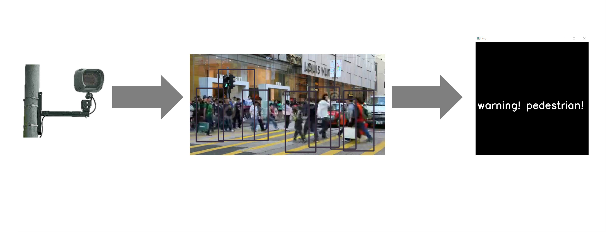

# Crosswalk pedestrian detection

## Inspiration
Pedestrians are injured most often when crossing the road at crosswalks.
Drivers who are not focused on the road fail to pay attention to pedestrians using the crosswalk as required by law, which results in fatal accidents that could have been avoided.

## Idea implementation
In this code, we've used OpenCV to look for pedestrians at crosswalks; if one is found, an alert will show up. 

The concept is to put cameras in front of the junctions so that we can identify people as they cross the street in real time and alert the drivers to stop.

Videos that simulate what the cameras will report are attached to the code, but you can just connect a camera and see the detection in real time.

Pedestrian detection are widely applied to  intelligent transportation, automotive autonomous driving or driving-assistance systems. 

***

Shilat Orkaby, Asnat Berlin and Iska Avitan

Bioinformatics Department, Jerusalem College of Technology

